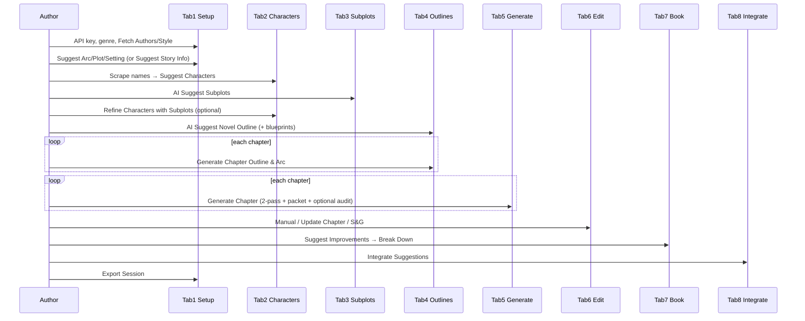

# NovelWriter Current Workflow Audit

**Source:** `NovelWriter/NovelWriter.html` v0.3.4 (~5097 lines)  
**Also skimmed:** `user_guide.html`, `REQUIREMENTS.md`, `NovelWriter/README.md`  
**State of truth:** `novelData` object (L573–607); `collectData()` (L4345+) populates it from the DOM before LLM calls.

---

## Architecture snapshot

- **11 tabs + Help** via `showTab(n)` (UIU.NW.F1).
- **All LLM traffic** goes through `callAI(messages, tabElement, …)` (L919+).
- **Agent system prompts** live in `defaultPromptCatalog` / `promptCatalog` (L711–749); resolved by `getAgentPrompt(tabKey, agentKey, fallback)` (L753).
- **Session I/O:** `exportSession()` / `importSession()` with schema `novel-schema-1.0` envelope (`schemaVersion: '1.0'`, `sourceTool: 'NovelWriter'`).
- **Prompt profiles** export/import independently via Tab 11 (`NovelWriterPromptCatalog`).
- **Continuity subsystem (Tab 5):** `chapterContinuityPackets`, `continuityTracker`, `continuityFindings`, Strict Continuity Mode, Auto Continuity Audit.

---

## Session fields (`novelData`)

| Field | Role |
|-------|------|
| `apiKey`, `model`, `maxTokens` | Provider config (API key not persisted on export) |
| `genre`, `title`, `storyArc`, `generalPlot`, `setting` | Story bootstrap |
| `numChapters`, `chapterLength` | Scale controls |
| `authorStyle`, `styleGuide`, `authors`, `author` | Voice |
| `characters[]` `{name, backstory, arc[, role, notes]}` | Cast |
| `subplots[]` | Subplot text blobs |
| `novelOutline`, `plotOutline`, `storyArcOutline` | Macro outlines |
| `chapterBlueprints[]` | Per-chapter structural plan from outline agent |
| `chapterOutlines[]`, `chapterArcs[]` | Per-chapter plans |
| `chapters[]`, `editedChapters[]` | Prose (synced Tab 5↔6) |
| `bookText`, `bookImprovements[]`, `bookImprovementsWithStatus[]` | Manuscript + critique |
| `outlineImprovements`, `chapterImprovements[]` | User revision notes |
| `continuityStrictMode`, `autoContinuityAudit` | Continuity toggles |
| `chapterContinuityPackets[]` | Per-chapter memory packets |
| `continuityTracker` `{chapters[], characterArcProgress[], storyArcProgress{}}` | Audit state |
| `continuityFindings[]` | Rolling risk log (capped ~200) |

---

## Tab-by-tab authoring flow

### Tab 1 — API & Story Info (`#tab1`, L240–300)

**Purpose:** Provider config + story bootstrap (genre, voice, title, arc, plot, setting, chapter counts).

**Key inputs:** `apiKey`, `model`, `maxTokens`, `genre`, `authorStyle`, `styleGuide`, `title`, `storyArc`, `generalPlot`, `setting`, `numChapters`, `chapterLength`.

**LLM actions (buttons):**
| Button | Function |
|--------|----------|
| Fetch Authors | `fetchAuthors()` L1054 |
| Fetch Style Guide | `fetchStyleGuide()` L1214 |
| Suggest Story Arc | `suggestStoryArc()` L1307 |
| Suggest General Plot | `suggestGeneralPlot()` L1391 |
| Suggest Setting | `suggestSetting()` L1489 |
| AI Suggest Story Info | `suggestStoryInfo()` L4145 |

**Context stuffed today:** Mostly **selective scalars** (genre/title/style/styleGuide). Arc→Plot→Setting chain includes prior fields. `suggestStoryInfo` sends existing title/arc/plot/setting/style. No characters/subplots yet.  
**Extra:** When `genre === 'scifi'`, `callAI` prepends a hard-SF system message (L942–946).

**Continuity / memory:** None.

**Export/import:** `Export Session` / `Import Session` on this tab (also Tab 7). Export strips `apiKey`, `model`, `maxTokens`, `authors`, `bookImprovements`, `chapterImprovements` (L3261–3268).

---

### Tab 2 — Characters (`#tab2`, L312–335)

**Purpose:** Cast definition (name / backstory / arc).

**Key inputs:** `numCharacters`, character cards (`.charName`, `.charBackstory`, `.charArc`).

**LLM actions:**
| Button | Function |
|--------|----------|
| Scrape Book Info for Characters | `scrapeBookInfoForCharacters()` L1583 |
| Suggest Characters | `suggestCharacters()` L1659 |
| Refine Characters with Subplots | `refineCharacters()` L1850 |

**Context:**
- Scrape: title + storyArc + generalPlot + setting (selective).
- Suggest: **full dump** of story scalars + `JSON.stringify(completeCharacters)` locked + name-only list + blank-slot count. Full styleGuide text included.
- Refine: **full dump** — all characters JSON + all subplots joined + arc/plot/setting/styleGuide.

**Continuity / memory:** None (character arcs are static text fields, not tracker state yet).

**Export/import:** Characters round-trip in session JSON.

---

### Tab 3 — Subplots (`#tab3`, L345–361)

**Purpose:** Generate/fill subplot textareas (min count via `minSubplots`).

**LLM actions:** `AI Suggest Subplots` → `suggestSubplots()` L1930.

**Context:** **Near-full dump** of story + `JSON.stringify(characters filtered complete)` + styleGuide + arc/plot/setting. Preserves filled slots; fills blanks; may append extras.

**Continuity / memory:** None.

---

### Tab 4 — Outlines (`#tab4`, L372–393)

**Purpose:** Macro outlines + per-chapter outline/arc + chapter blueprints.

**Key inputs:** `novelOutline`, `plotOutline`, `storyArcOutline`, `chapterBlueprints` (readonly display), `outlineImprovements`; per-chapter `chapterContent{N}` (Outline+Arc combined), `chapterImprovement{N}`.

**LLM actions:**
| Button | Function |
|--------|----------|
| AI Suggest Novel Outline | `generateNovelOutlines()` L3497 |
| Incorporate Suggestions | `incorporateOutlineSuggestions()` L3193 |
| Generate Chapter Outline & Arc (per ch) | `generateChapterOutline(n)` L3663 |
| Update (per ch) | `updateChapterOutline(n)` L3816 |

**Context:**
- Novel outlines: **full dump** — characters JSON, all subplots joined, existing outlines, styleGuide.
- Also requests `chapterBlueprints[]` with role/arcStep/subplotPressure/characterBeats/allowedPayoffs/deferredThreads (L3521–3522).
- Chapter outline: story scalars + filtered characters + subplots + all three macro outlines + existing chapter outline/arc + **blueprint** (or stage-based structural rule). Still large.
- Update chapter outline: similar full context + improvement notes.
- Incorporate: three outline fields + improvement notes only (selective relative to others).

**Continuity / memory:** Blueprints encode deferred threads / allowed payoffs — proto-L2 beats, but not yet wired into generation continuity packets except via chapter outline text.

---

### Tab 5 — Generate Chapters (`#tab5`, L404–417)

**Purpose:** Draft chapter prose (two LLM passes) + continuity packets/audits.

**Key inputs / controls:**
- Per-chapter `Generate Chapter` → `generateChapter(n)` L3893
- `continuityStrictMode` (default checked)
- `autoContinuityAudit` (default checked)
- `Rebuild Continuity Packets` → `rebuildContinuityPackets()` L2287
- `Run Continuity Audit (All Chapters)` → `runContinuityAuditAll()` L2400
- Continuity status panel (readonly)

**LLM actions:** `generateChapter` (2× `callAI` part1/part2), `continuityAudit` via `runChapterContinuityAudit`.

**Context stuffed today (generation):**
- Story arc, plot, setting (**full text**)
- **All complete characters** as JSON
- **All subplots** joined
- This chapter’s outline + arc
- **Continuity packet** as `JSON.stringify(packet)` (see below)
- Part 2 also includes **full first-half prose**
- Strict mode adds constraint lines about unresolved threads / next-chapter intent
- Style is mainly in the **system** prompt via authorStyle; styleGuide is **not** explicitly concatenated in the generateChapter user prompt (unlike outline/character tabs)

**Continuity packet** (`buildChapterContinuityPacket`, L2263–2285):
```
{
  chapter, mode: 'strict'|'balanced',
  storyArcAnchor: trim(storyArc + storyArcOutline, 1400),
  prevChapterSummary: trim(prev chapter text, 1200) OR opening marker,
  nextChapterIntent: trim(next outline, 700),
  activeSubplots: first 8 non-empty subplots (FULL texts, not digests),
  unresolvedThreads: last 8 threads from prior audits,
  trackedCharacterStates: continuityTracker.characterArcProgress
}
```
Uses `getTrimmedContext` head/tail trim (L2254).

**After generate:** `rebuildContinuityPackets()` then optional silent `runChapterContinuityAudit`.

**Audit context:** storyArc + plot + characters (name-filtered JSON) + full packet + **full chapter text** — can be large.

**Export/import:** Packets, tracker, findings, toggles round-trip (NW.T5.7).

---

### Tab 6 — Edit Chapters (`#tab6`, L426–433)

**Purpose:** Manual edit + AI revise + spell/grammar.

**LLM actions (per chapter):**
| Button | Function |
|--------|----------|
| Update Chapter | `updateChapter(n)` L4086 |
| Check Spelling & Grammar | `checkSpellingAndGrammar(n)` L2417 |

**Context (updateChapter):** **Heavy dump** — arc/plot/setting, **all characters JSON**, all subplots, all three macro outlines, chapter outline/arc, **last ~4000 chars of previous chapters** (`slice(-1000*4)`), current chapter full text, improvements, authorStyle, **full styleGuide**.

**Spell/grammar:** chapter text only (selective).

**Sync:** `syncChapterContent` keeps Tab 5/6 and `novelData.chapters` aligned. `collectData` sets `editedChapters = [...chapters]`.

---

### Tab 7 — Book (`#tab7`, L443+)

**Purpose:** Concatenated manuscript, export .txt, developmental critique + breakdowns.

**LLM actions:**
| Button | Function |
|--------|----------|
| Suggest Improvements | `suggestBookImprovements()` L2513 |
| Break Down (per row) | `breakdownImprovement(i)` L2696 |
| Export Book | `exportBook()` (no LLM) |
| Export Session | `exportSession()` |

**Context:**
- Suggest: **full book dump** (`chapters` concatenated with separators) — primary anti-pattern.
- Breakdown: improvement text + **affected chapter prose** (or all) + characters JSON + subplots + novel outline + chapter outlines — large.

**Statuses:** `To Incorporate` / `Incorporated` / `Ignored` on `bookImprovementsWithStatus`.

---

### Tab 8 — Consolidated Breakdowns (`#tab8`)

**Purpose:** Aggregate “To Incorporate” breakdowns; apply chapter revisions.

**LLM actions:** `Integrate Suggestions` → `integrateBreakdownSuggestions()` L2946 — **one `callAI` per targeted chapter**.

**Context per chapter:** improvement instruction lines + **full current chapter text**. Outline notes appended locally (no LLM). Status flipped to Incorporated.

**Also:** `Refresh Breakdowns` → `populateConsolidatedBreakdowns()` (no LLM).

---

### Tab 9 — Request Log

No LLM. Shows `requestLog` (lastPrompt, status, returnedInfo, tokens, cost, originTab).

---

### Tab 10 — Element Values

Debug dump of DOM/`novelData` via `displayElementValues()` — no LLM.

---

### Tab 11 — Agent Prompts

Edit/save/reset/import/export `promptCatalog` system prompts. All agents in catalog are editable here. Does not change user-message templates (those are hardcoded in functions).

---

## Typical paths

### New novel (happy path)



ASCII:

```
Tab1 (API+genre+style+arc/plot/setting)
  → Tab2 (scrape → suggest chars) → Tab3 (subplots)
  → [optional Tab2 refine] → Tab4 (novel outline+blueprints → per-ch outlines)
  → Tab5 (gen ch N with continuity packet; auto-audit)
  → Tab6 (edit/revise) → Tab7 (critique+breakdown) → Tab8 (integrate)
  → Export session / Export book .txt
```

### Continue chapter (resume / mid-book)

```
Import Session (restores chapters, packets, tracker, findings)
  → Tab5: Rebuild Continuity Packets (optional)
  → Tab5: Generate Chapter N  (packet uses prev chapter trim + prior unresolvedThreads)
  → OR Tab6: Update Chapter N with improvement notes
  → Optional: Run Continuity Audit (All) / single chapter via auto-audit
  → Export Session
```

---

## Continuity / memory packets — behavior summary

| Mechanism | Built when | Consumed by | Persisted |
|-----------|------------|-------------|-----------|
| `chapterContinuityPackets[i]` | `buildChapterContinuityPacket` on generate / rebuild / audit | `generateChapter`, `runChapterContinuityAudit` | Session export |
| `continuityTracker.chapters[i]` | Audit response | Next packet’s `unresolvedThreads`; status panel | Session |
| `characterArcProgress` / `storyArcProgress` | Audit (overwrites global tracker fields each audit) | Packet `trackedCharacterStates`; panel | Session |
| `continuityFindings` | Appended from risks (slice -200) | Panel / export | Session |
| `chapterBlueprints` | `generateNovelOutlines` | `generateChapterOutline` structural context | Session (display textarea) |

**Surprise:** Packets trim prev chapter & arc anchors, but still inject **up to 8 full subplot texts** and **full characterArcProgress array** without digesting. Audit overwrites global `characterArcProgress` with **last audited chapter’s** view (not a merged multi-chapter ledger). Style guide is omitted from generateChapter user prompts despite being central elsewhere.
